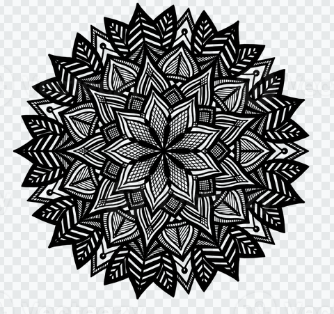
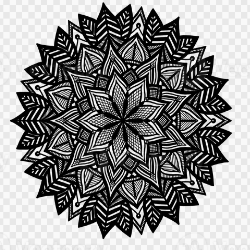
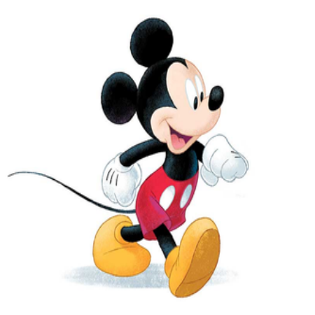

# bilinear-image-scaler-axistream
**FPGA-based real-time image scaler using bilinear interpolation over AXI-Stream interface, implemented in Verilog with a multi-stage pipeline and line-buffer architecture.**
A high-performance, **four-stage streaming hardware pipeline** that resizes images on the fly using bilinear interpolation. Designed with an **AXI-Stream** interface (in and out) and optimized to operate under real-world hardware memory constraints—**no full frame-buffer required**.

---
##  Project Details

This design is engineered to respect real-world constraints:
*   **True Streaming:** Pixels arrive one-by-one in raster order.
*   **Line-Buffered Cache:** Keeps only **3 rows** of the source image in memory at any given time, discarding old lines as the coordinate mapper sweeps downward.
*   **Drop-In Integration:** Native AXI-Stream handshaking controls backpressure across all internal stages, allowing the design to easily integrate into larger FPGA video processing pipelines.
---

## Pipeline Visual Results

Here is how the pipeline performs on both single-channel grayscale and multi-channel RGB data. The stretching is deliberate to benchmark non-uniform scaling factors.

### Grayscale Bilinear Scaling

| Source Image (480x451) | Scaled Pipeline Output (250x250) |
| :---: | :---: |
|  |  |

### RGB Bilinear Scaling

| Source RGB Image (335x272) | Scaled RGB Output (450x450) |
| :---: | :---: |
|  |  |


---

## Hardware Pipeline Architecture

The processing is split across four synchronous stages, synchronized by a master coordinate system and backward-propagated ready/valid handshake networks:

                        ┌──────────────┐
                        │ s_axis_tdata │ (Incoming Pixel Stream)
                        └──────┬───────┘
                               ▼
         ───────────┐      ┌───────────┐      ┌───────────┐      ┌───────────┐
        │  Stage 1  ├─────►│  Stage 2  ├─────►│  Stage 3  ├─────►│  Stage 4  │
        │  mapper   │      │  buffer   │      │  h_interp │      │  v_interp │
        └───────────┘      └───────────┘      └───────────┘      └─────┬─────┘
                                                                       ▼
                                                                ┌──────────────┐
                                                                │ m_axis_tdata │ (Scaled Output Stream)
                                                                └──────────────┘

### 1️⃣ Stage 1: Coordinate Mapper (`mapper.v`)
Calculates where each destination pixel "lands" in the source coordinate grid. Since scale factors are rarely integers, the landing spot is represented as fixed-point coordinates (default: 8 fractional bits). It tracks:
*   The bounding source pixel coordinates ($TL, TR, BL, BR$).
*   The fractional offsets (`frac_x`, `frac_y`) representing how close the point is to its neighbors.
*   A modulo-3 index tag mapping the target source lines to active cache slots.

### 2️⃣ Stage 2: Row Cache Buffer (`buffer.v`)
Stores exactly three source rows inside dual-port Block RAMs (divided into even/odd column banks to fetch adjacent horizontal pixels in a single clock cycle). 
*   **Producer/Consumer Synchronization:** The incoming AXI-Stream fills the empty slots, while Stage 1 coordinates read out the four bounding neighbors ($TL, TR, BL, BR$) simultaneously.
*   The buffer stalls the input if the cache is full, and stalls the pipeline if the required source rows have not yet arrived.

### 3️⃣ Stage 3: Horizontal Interpolator (`horizontal_interpolator.v`)
Performs the horizontal blending step. It computes two intermediate values:
*   The blend between Top-Left ($TL$) and Top-Right ($TR$) using `frac_x`.
*   The blend between Bottom-Left ($BL$) and Bottom-Right ($BR$) using `frac_x`.

### 4️⃣ Stage 4: Vertical Interpolator (`vertical_interpolator.v`)
Takes the two horizontally interpolated values and performs the final vertical blend using `frac_y`. The final scaled pixel is packed and driven onto the master AXI-Stream interface along with `m_axis_tlast` signals denoting row boundaries.

Every stage is parameterized by `NUM_CH` and `CH_W` to natively support both single-channel grayscale and multi-channel RGB formats.
---

## Repository Structure

| File Name | Purpose |
| :--- | :--- |
| **`image_scaler_top.v`** | Top-level module; instantiates and wires together the 4 processing stages. |
| **`mapper.v`** | Stage 1 — Bilinear coordinate mapping engine and fractional weight generator. |
| **`buffer.v`** | Stage 2 — Rolling 3-row cache buffer managing BRAM read/write domains. |
| **`bram.v`** | Memory primitive representing the dual-port RAMs inside the row buffers. |
| **`horizontal_interpolator.v`**| Stage 3 — Horizontal linear interpolation pipeline. |
| **`vertical_interpolator.v`** | Stage 4 — Vertical linear interpolation and output stream control. |
| **`input_image.v`** | Simulation helper: Streams pixel blocks from `input.hex` over AXI-Stream. |
| **`output_image.v`** | Simulation helper: Captures processing output into a flat `output.hex`. |
| **`testbench.v`** | Comprehensive testbench verifying handshakes, stalls, and output generation. |
| **`png_to_hex.py`** | Python tool converting standard source PNG images into `$readmemh` format. |
| **`hex_to_png.py`** | Python tool converting simulation-generated hex dumps back into viewable PNGs. |

---
---

## Verification & Challenges Overcome

Streaming hardware pipelines introduce complex synchronization issues. Key challenges solved during development include:
1.  **Mod-3 Cache Desync on Non-Integer Scaling:** Early designs updated modulo-3 trackers incrementally. On downscaling (where source rows are skipped), this caused immediate desynchronization. The fix computes the mod-3 index directly from the destination's absolute source row target on every clock cycle.
2.  **Row-Boundary Drift:** Replaced relative bit-slicing address trackers with an explicit column counter to ensure robust row boundary detection for images with non-power-of-two widths (e.g., 480 or 451 pixels).
3.  **Dropped End-Of-Frame Pixel:** Fixed a race condition where double writes to the validation logic at the end of a frame caused the last pixel to drop.

---
## How to Run the Simulation

You can compile and run this entire environment using the open-source tool **Icarus Verilog** and **Python 3**. No heavy, vendor-specific IDEs required.

### 1. Convert your source image to a hex file
```bash
# For Grayscale scaling
python3 png_to_hex.py image.png input.hex

# For 24-bit RGB scaling
python3 png_to_hex.py image.png input.hex --rgb
```
### 2. Compile the Verilog Source
```bash
iverilog -g2012 -o scaler_sim tb_image_scaler.v image_scaler_top.v \
mapper.v buffer.v horizontal_interpolator.v vertical_interpolator.v \
input_image.v output_image.v bram.v
```

### 3. Run the Simulation
```bash
vvp scaler_sim
```
### 4. Reconstruct the Output Image
```bash
# Convert grayscale output back to PNG (e.g., scaled to 960x500)
python3 hex_to_png.py output.hex result.png --width 960 --height 500

# Convert RGB output back to PNG
python3 hex_to_png.py output.hex result.png --width 960 --height 500 --rgb
```
---
## Parameterization

You can adjust scale factors, image sizes, and pixel widths directly via the `localparams` block inside the testbench (`tb_image_scaler.v`):
*   **`NUM_CH`**: Channel count. Set to `1` for Grayscale, or `3` for RGB.
*   **`CH_W`**: Pixel channel bit-width (default `8` bits per channel).
*   **`SRC_W` / `SRC_H`**: Source (input) image width and height.
*   **`DST_W` / `DST_H`**: Destination (output) image width and height.
*   **`FRAC_BITS`**: Number of fractional bits used in the fixed-point coordinate mapper (default `8` bits).
*   **`ADDR_BITS`**: Address bit-width for internal row and column indexing.
---

